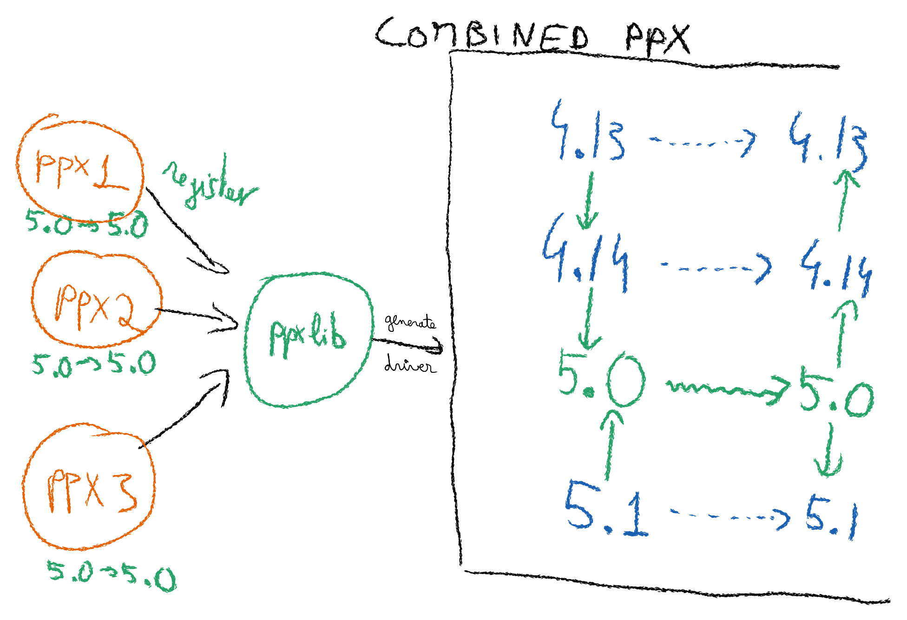

# Preprocessing in OCaml

{#pipeline pause}
## The compiler pipeline

<style>
#hand-ppxlib img {
  width:75%;
}

#hand-ppxlib {
  margin-top: -15px;
  text-align:center;
}

.language-handwritten-note {
  font-variant-ligatures: none;
  // otherwise eg "fi" is ligatured into a single character
}

.bold {
 font-weight: bold;
}

.green {
  color:darkgreen;
}

.flex {
  align-items: center;
  display: flex;
}

.gap {
  gap: 10px;
}

.grow {
  flex-grow: 1;
}

#container {
  display: flex;
  align-items: center;
  justify-content: center;
}

#compiler {
  padding-bottom: 300px;
  padding-right: 450px;
  border-image: linear-gradient(to right, red 0%, red 25%, blue 75%, blue 100%) 1
}

.arrow {
  font-size: 3em;
}

#input {
  border-image: linear-gradient(to right, transparent 0%, transparent 15%, red 50%, red 85%, red 100%) 1
}

#output {
  border-image: linear-gradient(to left, transparent 0%, transparent 15%, blue 50%, blue 85%, blue 100%) 1
}

.box {
  border-radius: 10px;
  border: 4px solid black;
  padding: 20px;
  margin:10px;
}

#spp {
  margin-top: 80px;
  display: inline-block;
  border-image: linear-gradient(to right, red 0%, red 15%, black 50%, red 85%, red 100%) 1
}

#ppx {
  margin-top: 80px;
  display: inline-block;
  border-image: linear-gradient(to right, darkgreen 0%, darkgreen 5%, yellow 50%, darkgreen 95%, darkgreen 100%) 1
}

</style>

{#container}
> {#input .box}
> > Input file
>
> {.arrow style="color:red"}
> > →
>
> {#compiler .box}
> > Compiler
>
> {.arrow style="color:blue"}
> > →
>
> {#output .box}
> > Output file

{.flex pause style="justify-content: space-evenly"}
> {.box #spp}
> Source Preprocessor
>
> {.box #ppx .unrevealed}
> PreProcessor eXtension

{pause down=pp-ex-1}

{#part-pp}
> ### Examples:
>
> {.flex .gap #pp-ex-1}
> > {.grow}
> > ```c
> > #define PI 3
> >
> > return PI;
> > ```
> >
> > {.arrow}
> > > →
> >
> > {.grow}
> > ```c
> >
> >
> > return 3;
> > ```
>
> {.flex .gap pause down}
> > {.grow}
> > ```ocaml
> > #if OCAML_VERSION >= (4,13)
> >   | Type_variant (tll,_) ->  
> > #else
> >   | Type_variant tll ->
> > #endif
> >         do_something
> > ```
> >
> > {.arrow}
> > > →
> >
> > {.grow}
> > ```ocaml
> > # 764 "src/loader/cmi.ml"
> >   | Type_variant (tll,_) ->  
> >
> > # 768 "src/loader/cmi.ml"
> >         do_something
> > ```
>
> {.flex .gap pause down #last-pp-ex}
> > {.grow}
> > ```ocaml
> > module Pretty = struct
> >   #include "prettyprint.ml"
> > end
> > ```
> >
> > {.arrow}
> > > →
> >
> > {.grow}
> > ```ocaml
> > module Pretty = struct
> > # 1 "prettyprint.ml"
> > < content of the file >
> > # 1 "prettyprint.ml"
> > end
> > ```
>
>
> {pause up=last-pp-ex .block}
> - Breaks most developper tools.
>
> - Good for "completely new syntax".
>
> - Difficult to do anything "OCaml-specific".
>
> - Handled by build system or `ocamlopt`'s `-pp` option. {pause}
>
> {#not-block .block title="Exercise time"}
> > **Don't use source preprocessing.** But let's do a quick exercise anyway 🤨
> >
> > Start with `0_source_preprocessing_exercise/README.md` (10min)


{pause up=pipeline}

{pause focus-at-unpause=compiler}

{pause unfocus-at-unpause}

{pause reveal-at-unpause=ppx}

{pause unstatic-at-unpause=part-pp}

{#part-ast}
> {#what-is-ast}
> ## What is the [result of parsing]{.green}
>
> In OCaml: a [`Parse`**`tree`**]{.green}.
>
> {pause up=what-is-ast}
>
> ### Expressions
>
> {.flex .gap}
> > ```ocaml
> > (x + 0) * (2 + 3)
> > ```
> > {style="font-size: 2em;"}
> > > →
>
>
> {.flex .gap pause}
> > ```ocaml
> > List.map
> >   (fun x -> expr)
> >   (1 :: [])
> > ```
> > {style="font-size: 2em;"}
> > > →
>
> {pause #type-ast}
> ### Types
>
> {.flex .gap}
> > ```ocaml
> > float -> int option
> > ```
> > {style="font-size: 2em;"}
> > > →
>
> {pause up=type-ast #module-ast}
> ### Modules
>
> {.flex .gap}
> > ```ocaml
> > module X = struct
> >   let n : float -> int option =
> >     expr
> >   let n2 : t = expr
> > end
> > ```
> > {style="font-size: 2em;"}
> > > →
>
> {pause up=module-ast}
> ### A walk in the `Parsetree`
>
> {.block title="Discovering a complex type"}
> - The [API in the manual](https://ocaml.org/manual/5.2/api/compilerlibref/Parsetree.html) (unique source of truth),
>
> - `utop -dparsetree`,
>
> - The [ast explorer](https://astexplorer.net/) website,
>
> - Editor support (?).
>
> {.block title="10 minutes"}
> Try anything you are curious about!

{pause up=pipeline}

{pause unstatic-at-unpause=part-ast}

{#part-handwrite}
> ## How to rewrite the parsetree?
>
> 1. Paperwork
>
> 1. `val transform : Parsetree.t -> Parsetree.t`
>
> 1. Paperwork
>
> {pause down .block title="Exercise time!"}
> > **Don't write PPX by hand.** But let's do a quick exercise anyway 🤨
> >
> > Start with `1_handmade_ppx_exercise/README.md` (20min)

{pause unstatic-at-unpause=part-handwrite up=pipeline}

{pause #what-could-go-wrong}
## What could go wrong?

{#list-problems .gap  .flex}
> {.grow .block}
> > {pause} [Everything. {pause down=list-problems} Here is a small list:]{.bold}
> > - Composability
> > - Opaqueness
> > - Efficiency
> > - Compatibility
> > - Maintenance
> > - Boilerplate
> > - Build complexity
>
> {.grow pause .block}
> > [We have a solution: `ppxlib`!]{.bold}
> >
> > - Handles the boilerplate
> > - Handles the compatibility
> > - Orchestrates rewriters
> > - Cooperates with `dune`
> > - Better performance
> > - Better composability
> > - Less opaqueness

{pause down #hand-ppxlib}


{pause down .block title="Exercise time!"}
> **Don't write global transformation by hand.** But let's do a quick exercise anyway 🤨
>
> Start with `4_global_transformations/README.md` (10min)
>
> Also, record your ideas for an interesting PPX.

{pause down #restricting}
> ## Restricting the rewriting
>
> We have seen that `dune` and `ppxlib` coordinate to solve the boilerplate/build
> complexity.
>
> {.block}
> **How about opaqueness and composability?**
>
> {pause}
> We need two Jokers 🃏🃏.

{pause up=restricting #attrs}
### Attributes, an attached Joker 🃏

{.definition}
Attributes are extra named `Parsetree` nodes that can be **attached** to a `Parsetree` node.

{pause}
#### Expressions/types/...

{.flex .gap}
> ```ocaml
> g[@inlined] x
> ```
> {style="font-size: 2em;"}
> > →

{pause up=attrs}
#### Structure/signature items

{.flex .gap}
> ```ocaml
> val f : int -> int
> [@@ocaml.deprecated
>   "Please use function g instead"]
> ```
> {style="font-size: 2em;"}
> > →

{pause down=stand}
#### Standalone

{.flex .gap #stand}
> ```ocaml
> [@@@ocaml.warnings "-42"]
> ```
> {style="font-size: 2em;"}
> > →

{pause up=standalone #ext-nodes}
### Extension nodes, a replacing Joker 🃏

{.definition}
**Extension nodes** are named `Parsetree` nodes that can **replace** a `Parsetree` node.

{pause}
#### Expressions/types/...

{.flex .gap}
> ```ocaml
> 1 + [%hello "world"]
> ```
> {style="font-size: 2em;"}
> > →

{pause up=ext-nodes}
#### Structure/signature items

{.flex .gap #ext-str-itm}
> ```ocaml
> module M = struct
>   [%%rewrite_me let f x = x]
>
>   let%rewrite_me f x = x
> end
> ```
> {style="font-size: 2em;"}
> > →

{pause up=ext-str-itm}
## Back to restricting

We are going to restrict the transformation in:

- **Their input**: No full `Parsetree` as input. **Context-free**.

- **Their effect**: No full `Parsetree` as output. **Local**.

<style>

  table {
    width: 100%;
    border-collapse: collapse;
    margin: 20px auto;
    box-shadow: 0 4px 8px rgba(0, 0, 0, 0.1);
  }

  th, td {
    padding: 12px 15px;
    text-align: center;
    border: 1px solid #ddd;
  }

  td, th {
    background-color: #fff;
    color: #333;
  }

</style>

{#table-guarantees}
| _          | Deriver                      | Extender                     |
|:----------:|:----------------------------:|:----------------------------:|
| **Input**  | Attributed node (right name) | Extension node  (right name) |
| **Output** | Nodes to append              | Node to replace             |

{pause up=table-guarantees}
### Examples

```ocaml
let before = 1

type foo = Bar of int | Baz [@@deriving show]

let after = 1
```

{pause down=deriv-exampl}
rewritten into

{#deriv-exampl}
```ocaml
let before = 1

type foo =
  | Bar of int
  | Baz [@@deriving show]
let rec pp_foo : Format.formatter -> foo -> unit =
  fun fmt -> function
   | Bar a0 ->
       Format.fprintf fmt "(@[<2>Bar@ ";
       Format.fprintf fmt "%d" a0;
       Format.fprintf fmt "@])"
   | Baz -> Format.pp_print_string fmt "Baz"
and show_foo : foo -> string =
  fun x -> Format.asprintf "%a" pp_foo x

let after = 1
```

{pause up}
### Examples

```ocaml
let before = 1

let to_ocaml = [%html "<a href='ocaml.org'>OCaml!</a>"]

let after = 1
```

rewritten into

{#extende-exampl}
```ocaml
let before = 1

let to_ocaml =
  Html.a ~a:[Html.a_href (Html.Xml.W.return "ocaml.org")]
    (Html.Xml.W.cons
       (Html.Xml.W.return (Html.txt (Html.Xml.W.return "OCaml!")))
       (Html.Xml.W.nil ()))

let after = 1
```

{pause .block down #less-opa}
- Less opaqueness

- More guarantees

- More composability

- **Many new ideas for transformations!**

{pause up=less-opa}

{step down=use-exe}

Derivers:

- `ppx_deriving.show` for deriving pretty printers.
- `ppx_deriving.eq` for deriving equality
- `ppx_deriving.ord` for deriving comparison
- `ppx_deriving.enum` for deriving enumerators
- `ppx_deriving.iter` for deriving iters
- `ppx_deriving.map` for deriving maps
- `ppx_deriving.fold` for deriving folds
- `ppx_deriving.make` for deriving constructors
- `ppx_show` for deriving pretty-printers
- `ppx_yojson_conv` for deriving json converters
- `ppx_deriving_yaml` for deriving yaml converters
- `ppx_sexp_conv` for deriving sexp converters
- `ppx_accessor` for deriving record accessors

Extenders:

{#exte-ex}
- `ppx_expect` for expect tests
- `ppx_inline_test` for inline tests
- `ppx_lwt` for monadic Lwt
- `ppx_tyxml` for writing HTML naturally
- `ppx_rapper` for writing SQL naturally

Let's use some of them:

{pause down .block title="Exercise time!" #use-exe}
> **Feel free to reuse in everyday life!**
>
> Start with `2_use_deriver_exercise/README.md`
>
> Then, `3_use_extender_exercise/README.md` (15 min total)

{pause up}
## Let's write a deriver now 😱

{down .block title="Exercise time!" #use-exe}
> **Feel free to reuse in everyday life!**
>
> Start with `write_deriver_exercise/README.md` (150 min total)

Some comments:

- `ppxlib` has a [documentation](https://ocaml.org/p/ppxlib/latest/doc/index.html).

- Remembering how `ppxlib` and `dune` cooperate can help.

- The `Parsetree` is a big and unstable type.

- `Ppxlib` provides some stability (at the expense of a little complexity,
  especially for pattern-matching).

- Be careful with locations. Having them wrong can harm the user experience,
  with Merlin being confused.

- Be careful with shadowing. If you access a module, do not expect anymodule to
  be open, qualify everything completely, and do not shadow existing definition.
