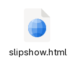

<style>
#nuage-de-points.stop p {
  transition: opacity 1s, transform 1s;
  opacity: 0.1;
}
#nuage-de-points p {
}
#nuage-de-points.stop .selected {
  opacity: 1;
  transform: scale(1.5);
}
#nuage-de-points.stop .finished {
  opacity: 0;
}
#nuage-de-points {
  display: flex;
  flex-wrap: wrap;
  gap: 0px;
  column-gap: 157px;
  font-size: 1.2em;
  justify-content: space-around;
}
#nuage-de-points p {
  margin-top: 20px;
  margin-bottom: 20px;
}
.abs {
  position: absolute;
}
#no-llms {
  top: 90px;
  left: 30px;
}
#compat-pointer {
  top: 590px;
  left: 530px;
  transform: rotate(40deg);
}
#can-make-coffee {
  top: 350px;
  left: 930px;
}
#nlnet-sponsored {
  top: 280px;
  left: 990px;
  transform: rotate(-10deg);
}
#type-safe {
  top: 230px;
  left: 390px;
  transform: rotate(-180deg);
}
#live-collab {
  top: 430px;
  left: -150px;
  transform: rotate(90deg);
}
#syntax-high {
  top: 530px;
  left: 870px;
  transform: rotate(-30deg);
}
#offline-first {
  top: 30px;
  left: 1670px;
  transform: rotate(-10deg);
}
#satheorem {
  top: 650px;
  left: 1170px;
  transform:  translateX(350px) rotate(-90deg);
}
#adaptative-scaling {
  top: 880px;
  left: 570px;
  transform:  translateX(350px) rotate(-55deg);
}
#user-def-dim {
  top: 90px;
  left: 570px;
}
#math_support {
  top: 180px;
  left: 1200px;
  transform: rotate(35deg);
}
#frame.stop {
  opacity: 1;
}
#frame {
  transition: opacity 3s;
  transition-delay: 2s;
  opacity: 0;
  position: absolute;
  top: 370px;
  left: 50px;
  width: 600px;
  height: 400px;
//  background-color: rgba(255,0,0,0.5);
  overflow: visible;
}
#rec1 {
  transform:  translate(-350px, -150px) scale(0.4);
}
</style>

# Slipshow: A *full-featured* presentation tool

{#nuage-de-points children:pause}
---

{#cmfiles}
Compile markdown files

{#gen-stand}
Generate *Standalone* HTML files

{#not-bs}
Not based on slides

{#can-zoom}
Can Zoom

{#can-annotate}
You can annotate your presentation

{#custom_script}
Custom scripts

{#hot-reloading}
Write your presentation with hot-reloading

{#embedded-pdfs}
Support for embedding PDFs

{#video}
Embed Videos and Audio

{#available-static}
Available as a static binary

{#available-vscode}
Available as a VSCode extension

{#available-gui}
Available with a GUI

{#bidirectional}
Bi-directional

{#feature-toc}
Features a table of content

{#feature-theme}
Has supports for themes

{#custom_script2}
Allow the execution of custom scripts

{#nbosbst}
Not based on slides (but supports them)

{#extensible-js}
Extensible via JavaScript

{#markdown-output}
Markdown output

{#has-speaker-view}
Speaker view

{#front-support}
Frontmatter support

{#mobile-support}
Mobile support

{#multi-input}
Multi-file input

{#hierar-pres}
Hierarchical presentation

{#many-predefined-actions}
Many predefined actions

{#ext-doc-tut}
Extensive documentation and tutorial

{#friendly-community}
Friendly community (me)

{#ext-help-page}
Extensive help page

{#open-source}
Open source

{#secure-by-design}
Secure-by-design

{#lightning-fast}
Lightning fast

{#has-nice-logo}
Has a nice logo

{#fun-name}
Fun name

{#versionning-friendly}
Versionning-friendly

{.abs #no-llms}
No LLM knows about it

{.abs #compat-pointer}
Compatible with pointer devices

{.abs #can-make-coffee}
Can make coffee

{.abs #nlnet-sponsored}
Sponsored by NLNet

{.abs #type-safe}
Type safe

{.abs #live-collab}
Live-collaboration editing

{.abs #syntax-high}
Syntax highlighting

{.abs #offline-first}
Offline first

{.abs #satheorem}
Support for environment such as `theorem`

{.abs #adaptative-scaling}
Adaptative scaling

{.abs #user-def-dim}
User-defined dimensions

{.abs #math_support}
Mathematics support

---

{exec}
```slip-script
slip.setClass(document.querySelector("#nuage-de-points"), "stop", true);
```

{exec pause}
```slip-script
slip.setClass(document.querySelector("#cmfiles"), "selected", true);
```

<style>
.addons {
  position:absolute;
}
#cmf-addons {
  top:300px;
  left:600px;
  width: 900px;
  display: flex;
  justify-content: space-around;
}
</style>

{#cmf-addons .addons .block}
> ```
> ## Title
>
> Wait for it...
>
> {pause}
>
> **Surprise!**
> ```
> ---
>
> ## Title
>
> Wait for it...
>
> {pause}
>
> **Surprise!**

{exec pause unstatic=cmf-addons}
```slip-script
slip.setClass(document.querySelector("#cmfiles"), "finished", true);
slip.setClass(document.querySelector("#cmfiles"), "selected", false);
slip.setClass(document.querySelector("#gen-stand"), "selected", true);
```

<style>
#icon {
  top:400px;
  left:600px;
  width:400px;
  text-align: center;
}
#icon img {
  width:300px;
}
</style>

{#icon .addons .block}
 <!-- TODO: turn into a gif -->

{exec unstatic=icon pause}
```slip-script
slip.setClass(document.querySelector("#gen-stand"), "finished", true);
slip.setClass(document.querySelector("#gen-stand"), "selected", false);
slip.setClass(document.querySelector("#not-bs"), "selected", true);
```

<style>
#nbos {
  top:300px;
  left:600px;
  width: 900px;
}
</style>

{#nbos .addons .block}
> We are still on slide 1?
> 

{exec pause unstatic=nbos}
```slip-script
slip.setClass(document.querySelector("#not-bs"), "finished", true);
slip.setClass(document.querySelector("#not-bs"), "selected", false);
slip.setClass(document.querySelector("#can-zoom"), "selected", true);
```

<style>
#cz-addons {
  top:300px;
  left:600px;
  width: 500px;
}
</style>

{#cz-addons .addons .block}
> ```
> {focus=can-zoom-popup}
> ```

{focus=cz-addons}

{unfocus}

{exec pause unstatic=cz-addons}
```slip-script
slip.setClass(document.querySelector("#can-zoom"), "finished", true);
slip.setClass(document.querySelector("#can-zoom"), "selected", false);
slip.setClass(document.querySelector("#nbosbst"), "selected", true);
```

<style>
#nbbs-addons {
  top:000px;
  left:600px;
  width: 1000px;
}
</style>

{#nbbs-addons .addons .block carousel change-page=~n:all children:slide children:no-enter}
>
> # Slide 1
>
> Lorem ipsum 
>
> - Content 1
>
> - Content 2
>
> ---
> # Slide 2
> Another content

{exec pause unstatic=nbbs-addons}
```slip-script
slip.setClass(document.querySelector("#nbosbst"), "finished", true);
slip.setClass(document.querySelector("#nbosbst"), "selected", false);
slip.setClass(document.querySelector("#can-annotate"), "selected", true);
```

{exec pause unstatic=nbbs-addons}
```slip-script
slip.setClass(document.querySelector("#can-annotate"), "finished", true);
slip.setClass(document.querySelector("#can-annotate"), "selected", false);
slip.setClass(document.querySelector("#custom_script"), "selected", true);
slip.setClass(document.querySelector("#custom_script2"), "selected", true);
```

{exec pause unstatic=nbbs-addons}
```slip-script
slip.setClass(document.querySelector("#custom_script"), "finished", true);
slip.setClass(document.querySelector("#custom_script"), "selected", false);
slip.setClass(document.querySelector("#custom_script2"), "finished", true);
slip.setClass(document.querySelector("#custom_script2"), "selected", false);
slip.setClass(document.querySelector("#bidirectional"), "selected", true);
```

{exec pause unstatic=nbbs-addons}
```slip-script
slip.setClass(document.querySelector("#bidirectional"), "finished", true);
slip.setClass(document.querySelector("#bidirectional"), "selected", false);
slip.setClass(document.querySelector("#video"), "selected", true);
```

{exec pause unstatic=nbbs-addons}
```slip-script
slip.setClass(document.querySelector("#video"), "finished", true);
slip.setClass(document.querySelector("#video"), "selected", false);
slip.setClass(document.querySelector("#embedded-pdfs"), "selected", true);
```

{exec pause unstatic=nbbs-addons}
```slip-script
slip.setClass(document.querySelector("#embedded-pdfs"), "finished", true);
slip.setClass(document.querySelector("#embedded-pdfs"), "selected", false);
slip.setClass(document.querySelector("#feature-toc"), "selected", true);
```

{exec pause unstatic=nbbs-addons}
```slip-script
slip.setClass(document.querySelector("#feature-toc"), "finished", true);
slip.setClass(document.querySelector("#feature-toc"), "selected", false);
slip.setClass(document.querySelector("#feature-theme"), "selected", true);
```

{exec pause unstatic=nbbs-addons}
```slip-script
slip.setClass(document.querySelector("#feature-theme"), "finished", true);
slip.setClass(document.querySelector("#feature-theme"), "selected", false);
slip.setClass(document.querySelector("#markdown-output"), "selected", true);
```

{exec pause unstatic=nbbs-addons}
```slip-script
slip.setClass(document.querySelector("#markdown-output"), "finished", true);
slip.setClass(document.querySelector("#markdown-output"), "selected", false);
slip.setClass(document.querySelector("#hot-reloading"), "selected", true);
```

{exec pause unstatic=nbbs-addons}
```slip-script
slip.setClass(document.querySelector("#hot-reloading"), "finished", true);
slip.setClass(document.querySelector("#hot-reloading"), "selected", false);
slip.setClass(document.querySelector("#available-static"), "selected", true);
```

{exec pause unstatic=nbbs-addons}
```slip-script
slip.setClass(document.querySelector("#available-static"), "finished", true);
slip.setClass(document.querySelector("#available-static"), "selected", false);
slip.setClass(document.querySelector("#available-vscode"), "selected", true);
```

{exec pause unstatic=nbbs-addons}
```slip-script
slip.setClass(document.querySelector("#available-vscode"), "finished", true);
slip.setClass(document.querySelector("#available-vscode"), "selected", false);
slip.setClass(document.querySelector("#available-gui"), "selected", true);
```

{exec pause unstatic=nbbs-addons}
```slip-script
slip.setClass(document.querySelector("#available-gui"), "finished", true);
slip.setClass(document.querySelector("#available-gui"), "selected", false);
slip.setClass(document.querySelector("#extensible-js"), "selected", true);
```

{exec pause unstatic=nbbs-addons}
```slip-script
slip.setClass(document.querySelector("#extensible-js"), "finished", true);
slip.setClass(document.querySelector("#extensible-js"), "selected", false);
slip.setClass(document.querySelector("#has-speaker-view"), "selected", true);
```

{exec pause unstatic=nbbs-addons}
```slip-script
slip.setClass(document.querySelector("#has-speaker-view"), "finished", true);
slip.setClass(document.querySelector("#has-speaker-view"), "selected", false);
slip.setClass(document.querySelector("#multi-input"), "selected", true);
```

{exec pause unstatic=nbbs-addons}
```slip-script
slip.setClass(document.querySelector("#multi-input"), "finished", true);
slip.setClass(document.querySelector("#multi-input"), "selected", false);
slip.setClass(document.querySelector("#front-support"), "selected", true);
```

{exec pause unstatic=nbbs-addons}
```slip-script
slip.setClass(document.querySelector("#front-support"), "finished", true);
slip.setClass(document.querySelector("#front-support"), "selected", false);
slip.setClass(document.querySelector("#adaptative-scaling"), "selected", true);
```

{exec pause unstatic=nbbs-addons}
```slip-script
slip.setClass(document.querySelector("#adaptative-scaling"), "finished", true);
slip.setClass(document.querySelector("#adaptative-scaling"), "selected", false);
slip.setClass(document.querySelector("#math_support"), "selected", true);
```

{exec pause unstatic=nbbs-addons}
```slip-script
slip.setClass(document.querySelector("#math_support"), "finished", true);
slip.setClass(document.querySelector("#math_support"), "selected", false);
slip.setClass(document.querySelector("#live-collab"), "selected", true);
```

{exec pause unstatic=nbbs-addons}
```slip-script
slip.setClass(document.querySelector("#live-collab"), "finished", true);
slip.setClass(document.querySelector("#live-collab"), "selected", false);
slip.setClass(document.querySelector("#open-source"), "selected", true);
```

{exec pause unstatic=nbbs-addons}
```slip-script
slip.setClass(document.querySelector("#open-source"), "finished", true);
slip.setClass(document.querySelector("#open-source"), "selected", false);
slip.setClass(document.querySelector("#user-def-dim"), "selected", true);
```

{exec pause unstatic=nbbs-addons}
```slip-script
slip.setClass(document.querySelector("#user-def-dim"), "finished", true);
slip.setClass(document.querySelector("#user-def-dim"), "selected", false);
slip.setClass(document.querySelector("#ext-help-page"), "selected", true);
```

{exec pause unstatic=nbbs-addons}
```slip-script
slip.setClass(document.querySelector("#ext-help-page"), "finished", true);
slip.setClass(document.querySelector("#ext-help-page"), "selected", false);
slip.setClass(document.querySelector("#ext-doc-tut"), "selected", true);
```

{exec pause unstatic=nbbs-addons}
```slip-script
slip.setClass(document.querySelector("#ext-doc-tut"), "finished", true);
slip.setClass(document.querySelector("#ext-doc-tut"), "selected", false);
slip.setClass(document.querySelector("#hierar-pres"), "selected", true);
```

{exec pause unstatic=nbbs-addons}
```slip-script
slip.setClass(document.querySelector("#hierar-pres"), "finished", true);
slip.setClass(document.querySelector("#hierar-pres"), "selected", false);
slip.setClass(document.querySelector("#syntax-high"), "selected", true);
```

{exec pause unstatic=nbbs-addons}
```slip-script
slip.setClass(document.querySelector("#syntax-high"), "finished", true);
slip.setClass(document.querySelector("#syntax-high"), "selected", false);
slip.setClass(document.querySelector("#mobile-support"), "selected", true);
```

{exec pause unstatic=nbbs-addons}
```slip-script
slip.setClass(document.querySelector("#mobile-support"), "finished", true);
slip.setClass(document.querySelector("#mobile-support"), "selected", false);
slip.setClass(document.querySelector("#satheorem"), "selected", true);
```

{exec pause unstatic=nbbs-addons}
```slip-script
slip.setClass(document.querySelector("#satheorem"), "finished", true);
slip.setClass(document.querySelector("#satheorem"), "selected", false);
slip.setClass(document.querySelector("#nlnet-sponsored"), "selected", true);
```

{exec pause unstatic=nbbs-addons}
```slip-script
slip.setClass(document.querySelector("#nlnet-sponsored"), "finished", true);
slip.setClass(document.querySelector("#nlnet-sponsored"), "selected", false);
slip.setClass(document.querySelector("#lightning-fast"), "selected", true);
```

{exec pause unstatic=nbbs-addons}
```slip-script
slip.setClass(document.querySelector("#lightning-fast"), "finished", true);
slip.setClass(document.querySelector("#lightning-fast"), "selected", false);
slip.setClass(document.querySelector("#fun-name"), "selected", true);
```

{exec pause unstatic=nbbs-addons}
```slip-script
slip.setClass(document.querySelector("#fun-name"), "finished", true);
slip.setClass(document.querySelector("#fun-name"), "selected", false);
slip.setClass(document.querySelector("#offline-first"), "selected", true);
```

{exec pause unstatic=nbbs-addons}
```slip-script
slip.setClass(document.querySelector("#offline-first"), "finished", true);
slip.setClass(document.querySelector("#offline-first"), "selected", false);
slip.setClass(document.querySelector("#many-predefined-actions"), "selected", true);
```

{exec pause unstatic=nbbs-addons}
```slip-script
slip.setClass(document.querySelector("#many-predefined-actions"), "finished", true);
slip.setClass(document.querySelector("#many-predefined-actions"), "selected", false);
slip.setClass(document.querySelector("#has-nice-logo"), "selected", true);
```

{exec pause unstatic=nbbs-addons}
```slip-script
slip.setClass(document.querySelector("#has-nice-logo"), "finished", true);
slip.setClass(document.querySelector("#has-nice-logo"), "selected", false);
slip.setClass(document.querySelector("#type-safe"), "selected", true);
```

{exec pause unstatic=nbbs-addons}
```slip-script
slip.setClass(document.querySelector("#type-safe"), "finished", true);
slip.setClass(document.querySelector("#type-safe"), "selected", false);
slip.setClass(document.querySelector("#compat-pointer"), "selected", true);
```

{exec pause unstatic=nbbs-addons}
```slip-script
slip.setClass(document.querySelector("#compat-pointer"), "finished", true);
slip.setClass(document.querySelector("#compat-pointer"), "selected", false);
slip.setClass(document.querySelector("#versionning-friendly"), "selected", true);
```

{exec pause unstatic=nbbs-addons}
```slip-script
slip.setClass(document.querySelector("#versionning-friendly"), "finished", true);
slip.setClass(document.querySelector("#versionning-friendly"), "selected", false);
slip.setClass(document.querySelector("#friendly-community"), "selected", true);
```

{exec pause unstatic=nbbs-addons}
```slip-script
slip.setClass(document.querySelector("#friendly-community"), "finished", true);
slip.setClass(document.querySelector("#friendly-community"), "selected", false);
slip.setClass(document.querySelector("#secure-by-design"), "selected", true);
```

{exec pause unstatic=nbbs-addons}
```slip-script
slip.setClass(document.querySelector("#secure-by-design"), "finished", true);
slip.setClass(document.querySelector("#secure-by-design"), "selected", false);
slip.setClass(document.querySelector("#no-llms"), "selected", true);
```

{exec pause unstatic=nbbs-addons}
```slip-script
slip.setClass(document.querySelector("#no-llms"), "finished", true);
slip.setClass(document.querySelector("#no-llms"), "selected", false);
slip.setClass(document.querySelector("#can-make-coffee"), "selected", true);
```

{exec pause unstatic=nbbs-addons}
```slip-script
slip.setClass(document.querySelector("#can-make-coffee"), "finished", true);
slip.setClass(document.querySelector("#can-make-coffee"), "selected", false);
```

1. Slipshow: Compile from markdown, to a standalone html file, not based on slides.
  - Slipshow basics
  - Actions
  - Allow the execution of custom scripts
2. Zoom, visual structure
  - Just see this presentation
3. Hot reloading and live-collaboration on sliphub
  - Demonstration
  - Call people to stress-test a sliphub presentation
  - Explain that it's more complicated than it looks: explain the two panels
4. Embed PDFs, video, audio
  - Pdf: OCaml manual?
  - Video: recursive video
5. Speaker view
  - Just a demo


---
# The SECRET of how to achieve full-featuredness in 3 SIMPLE STEPS


## 1. ORGANIZATION

Several team:
Engine   Runtime   Compiler   Language    Adoption    Ecosystem

Use Very Agile method

Many people working on it:
Back-end engineer: Paul-Elliot
Community manager: Paul-Elliot
MacOS specialist: Paul-Elliot
Front-end engineer: Paul-Elliot
Full-stack engineer: Paul-Elliot
UI/UX designer: Paul-Elliot
Distribution: Paul-Elliot
Marketing: Paul-Elliot
Technical Writer: Paul-Elliot
HR: Paul-Elliot
DevOps / Sysadmin: Paul-Elliot
QA / Tester: Paul-Elliot
Release Manager: Paul-Elliot
Documentation Writer: Paul-Elliot
Tech Support: Paul-Elliot
Product Manager: Paul-Elliot
Security Officer: Paul-Elliot
Legal Department: Paul-Elliot
Finance / Accounting: Paul-Elliot
Human Resources (HR): Paul-Elliot
Recruiter: Paul-Elliot
Data Analyst: Paul-Elliot
Customer Success: Paul-Elliot
Research & Development (R&D): Paul-Elliot
Ethics Board: Paul-Elliot
CEO / CTO / COO: Paul-Elliot
Intern: Paul-Elliot


## 2. HYGIENE

All people working on Slipshow follow a strict hygiene of life to achieve greater efficiency:

- 5am – Waking up,
- 5:15am – Go for a footing,
- 6am – Sun salutations and stretching,
- 6:30 – Cold shower,
- 6:45 – eat vegan breakfast
- 7am – Solo Agile standup
- 8am-12pm – Pomodoro sessions with deep breathing in between
- 12pm-1pm – Fasting window (Yogi tea)
- 1pm – Squats and abs (10 reps).
- 1:30pm-5pm – Pomodoro sessions with deep breathing in between
- 5pm – No meeting

<!-- Pay to unlock. I'll make it free but you can buy my other book, How to
achieve transcendence in three simple steps -->
## 3. OCaml

Well, actually that is the main reason.

- A single language for browser and (static) native code
  - Static typing,
  - Precise compiler errors
TODO: demonstrate refactoring with Communication module
  - Lovely syntax
TODO: speak about undo monad
  - Many advanced features
    - Functors and First class module: actions
    - GADT: TODO
    - Extensible variants: AST and Cmarkit
    - Effects: I'm still trying
- Excellent tooling
  - Dune
    - Slipshow's build is complex
    - Vendoring is easy
    - Moving directories is easy
    - Monorepoing is easy
  - Merlin/Ocaml-lsp-server/Ocaml-eglot
  - OCamlformat

(OCaml also has disappointed me.
  * Only few choices between extra high quality libraries
  * Compilation is a bit too fast
  * Can't multiply a string and a float
  * [...])

# Conclusion

And the conclusion is that...

Slipshow has a lot of features ... (recommencer la présentation depuis le début)

Puis revenir au début et dire

There is NO conclusion. Use the tools you like to build the software you love.

<!--
   Life is a process. Slipshow started as Javascript, it became OCaml, what will it be next I don't know.
   Work on what you like

-->
