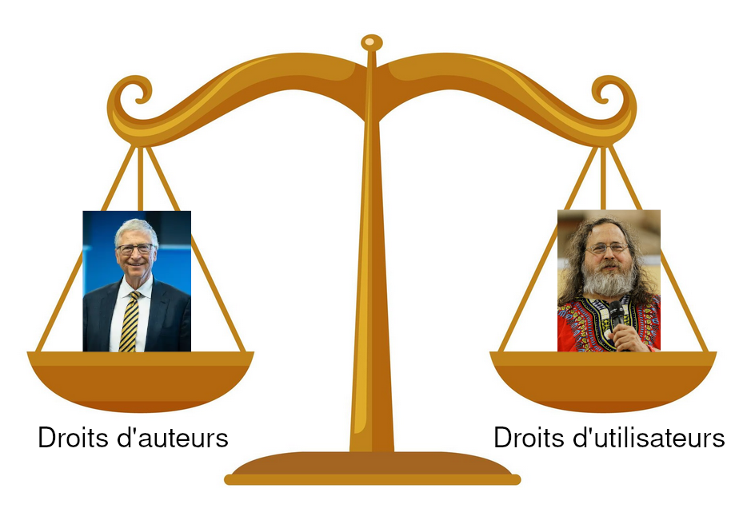

# L'open [source]{#source} [~~source~~ bouffe]{#bouffe .unrevealed}  [source]{#source2 style="position: absolute; visibility:hidden" .unrevealed}

{pause reveal-at-unpause=bouffe unstatic-at-unpause=source static-at-unpause=source2 }

{pause}

<style>
slip-body { font-size: 1.1em; line-height: 50px; }
.date {
  font-size:2em;
  font-weight: bold;
  padding-right: 40px;
  float: left;
}
.vskip { padding-top:10px; }
</style>

{.vskip}


[1970]{.date} Peu de gens savent cuisiner, c'est une nouvelle discipline. **Aucune rêgle** ne
régit le monde de la gastronomie.  {pause}

{.vskip}

[1976]{.date} Bill Cake milite pour le **droit d'auteur** sur les recettes. Besoin de
permission pour copier, interdiction de modifier.

La majorité des recettes deviennent des produits commerciaux, achetés en
supermarché, sans recette. {pause} 🤑 🤑 🤑 {pause}

[1980]{.date} Richard Saltman (chef cuistot) souhaite modifier un gateau (trop
sucré). Mais la recette ne peut être partagée !

{pause #scale down style="text-align:center"}


{pause down=GPL}
La philosophie GNU : quatre principes.

{#principles}
1. Liberté **d'utiliser**
1. Liberté **d'étudier**
1. Liberté de **modifier**
1. Liberté de **redistribuer** {pause}
1. Ma liberté d'arrête là où commence celle des autres! **Copyleft** 🦠

{#GPL}
**C'est la naissance de la licence GPL ! (General Public Licence)**

- Exemples : Les recettes suivantes peuvent-elles être GPL ?

{pause #r1 up=principles}
```
- Passer au grille-pain Tefal™ un muffin anglais Monoprix™
- Tartiner 1 mm de beurre Président™
- Tartiner 1 mm de Nutella™
```

{pause #r2}
```
- Faire du pain (cf pain libre)
- Faire griller au grille-pain Tefal™ deux tranches du pain obtenu
- Tartiner 1mm de patate bouillie et sucrée
```

{pause #is_legal unstatic-at-unpause="r1 r2"}
- Les situations suivantes sont-elles légales ?

{#r3}
```
- Je crée une recette de patate au nutellibre
- Je publie la recette sous licence GPL
- Je vend ma patate au nutellibre (très cher)
```

{#r4 pause}
```
- Je crée une recette de spagethlibres à la GPL
- Je publie la recette, mais interdit de vendre le produit
```

{pause down=th_oss}
# Les recette libres, un virus ?

1. Liberté **d'utiliser**, **d'étudier**, **modifier**, **redistribuer**
1. **Copyleft**: interdiction de restreindre ces libertés dans un produit dérivé

{pause .theorem #th_oss}
> Une recette GPL implique que tous ses ingrédients soient "ouverts".
>
> Un ingrédient GPL implique que la recette est GPL.

{.vskip}

{.vskip}

{.vskip #thunes}

{.vskip}

{pause center-at-unpause}
# 🤑 🤑 Et la thunes dans tout ça ? 🤑 🤑


{.vskip}

{.vskip}

{.vskip}

{.vskip}

{pause}

[1998]{.date #mnnh} Éric Raymond'or invente le terme "Open Source". {pause} L'open
  source est un **modèle de developement** de recettes communautaires, au
  **modèle économique alléchant**.

{pause up=thunes #mit}
## Licence MIT:

- Liberté d'utiliser, étudier, modifier, distribuer
- Obligation de conserver l'attribution dans la recette

{pause up=mnnh}

### De nombreux avantages !

- 💸 C'est "gratuit".
- 💸💸 Mutualisation pour les ingrédients de base.
- 💸💸💸 [Profite des amateurs qui contribuent gratuitement]{#gratos} [Profite des amateurs qui contribuent gratuitement]{#gratos2 style="position: absolute ; font-weight: bold;" .unrevealed}.

Certains projets open source ont de gros financements de grosses entreprises.
{pause up=mit}
Mais en général le financement est minimal pour que ça perdure.

### Sources de subsistance pour un projet libre :

- Vente du produit fini,
- Support et formation,
- Fonctionnalités payantes,

{pause static-at-unpause=gratos2 reveal-at-unpause=gratos2 unstatic-at-unpause=gratos}

{pause #profit}
## 🤑 Comment profiter gratuitement des amateurs ?

{pause up=profit}

C'est déjà difficile de collaborer à deux... Alors à 8 milliards ?

{pause}

- Avant: on s'envoyait des mails...

- Maintenant : on utiliser un logiciel libre GPL: `git`.

{pause}

- Montrer un répo avec une recette simple
- Modifier la recette et pusher (Dropbox avec des modifications atomiques)
- Proposer ses modifications à quelqu'un d'autre.

## Qu'est-ce que c'est que ça

## Comment gagner de l'argent avec un truc gratuit

## Comment collaborer à 8 milliards

## Idées

- Montrer une tablette de chocolat avec la recette et demander si elle est open
  source (à ceux qui connaissent)
- Avoir le fantôme du capitalisme rampant sur l'écran
- Avoir le virus de l'open source
- Le mélange des deux
- Faker.js (un dev corromp sa librairie)
- 

  Comment réconcilier auteur et usager ?

  - Est-il possible de manger le produit ?
  - Est-il possible de consulter la recette ?
  - Est-il possible de réaliser la recette ?
  - La modifier ?
  - Donner/Vendre des produits faits avec ?
  - Donner/Vendre des produits faits avec une version modifiée, en donnant la recette ?
  - Donner/Vendre des produits faits avec une version modifiée, sans donner la recette, mais en créditant l'auteur ?
  - Donner/Vendre des produits faits avec une version modifiée, sans donner la recette, sans créditer l'auteur ?
  - Faire un procès à l'auteur car on a eu une indigestion
