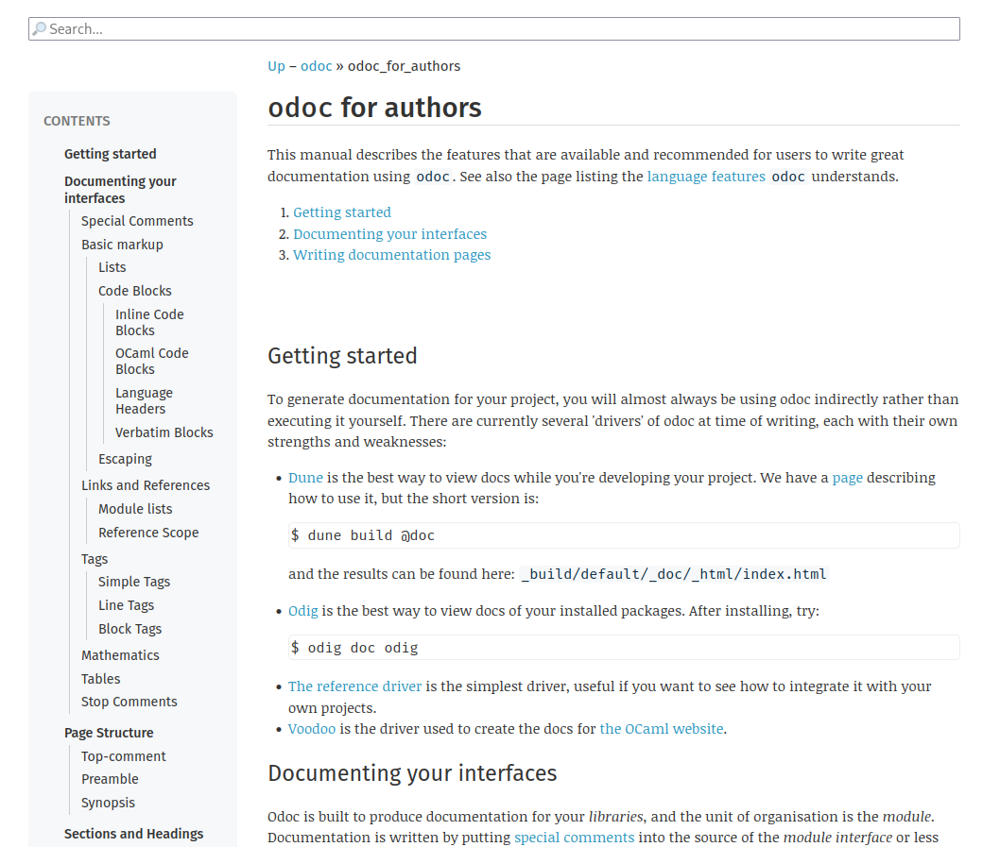
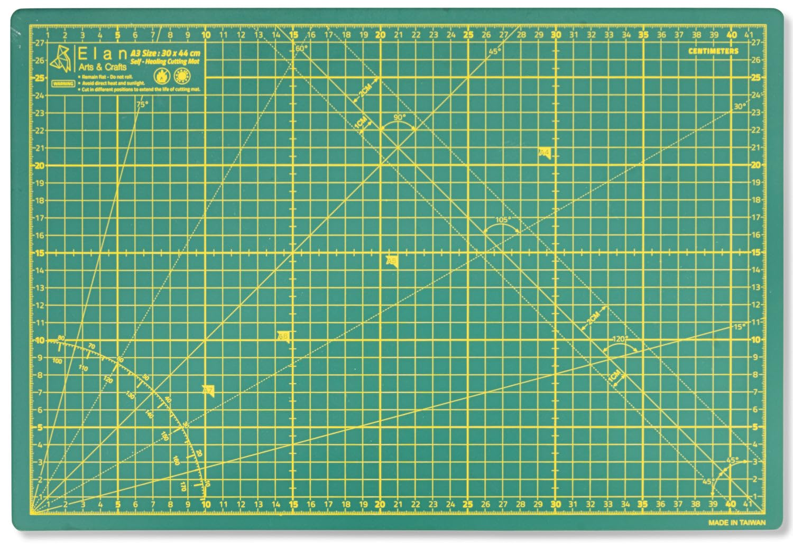
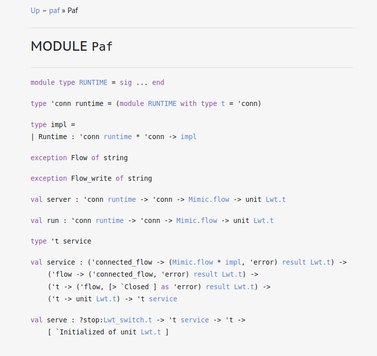
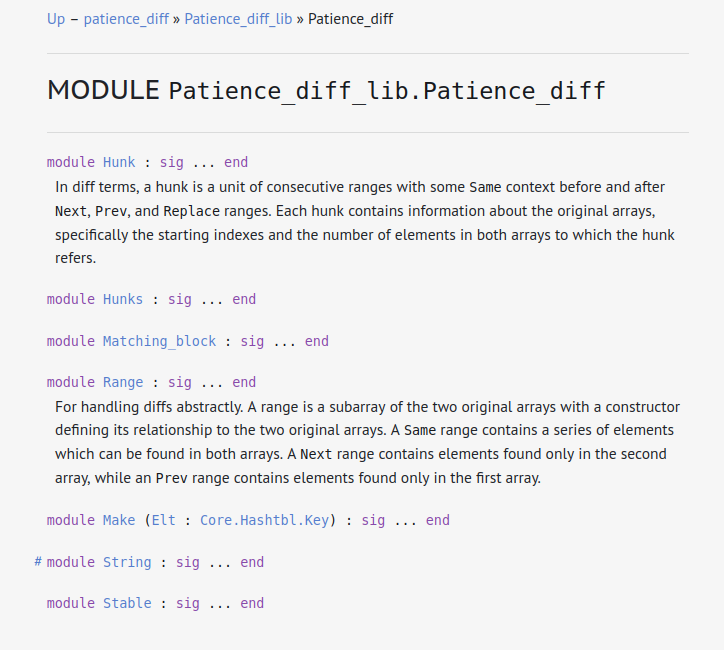
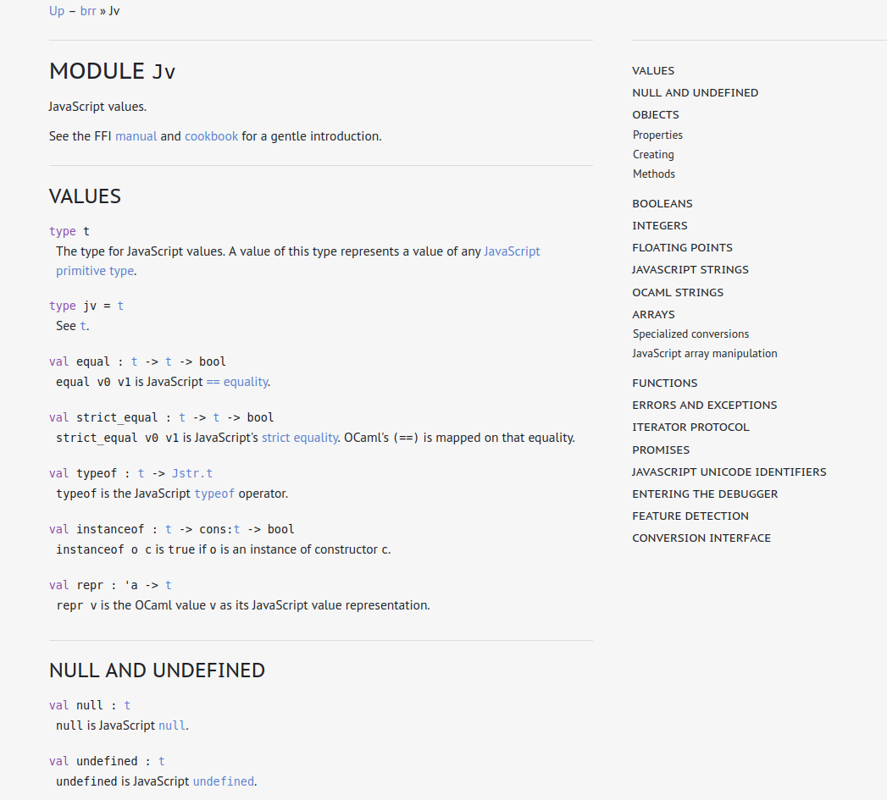

# DIY: build your own documentation.

<style>

body {
  /* Start the shake animation and make the animation last for 0.5 seconds */
  animation: shake 0.5s;

  /* When the animation is finished, start again */
  animation-iteration-count: 0;
}

@keyframes shake {
  0% { transform: translate(1px, 1px) rotate(0deg); }
  10% { transform: translate(-1px, -2px) rotate(-1deg); }
  20% { transform: translate(-3px, 0px) rotate(1deg); }
  30% { transform: translate(3px, 2px) rotate(0deg); }
  40% { transform: translate(1px, -1px) rotate(1deg); }
  50% { transform: translate(-1px, 2px) rotate(-1deg); }
  60% { transform: translate(-3px, 1px) rotate(0deg); }
  70% { transform: translate(3px, 1px) rotate(-1deg); }
  80% { transform: translate(-1px, -1px) rotate(1deg); }
  90% { transform: translate(1px, 2px) rotate(0deg); }
  100% { transform: translate(1px, -2px) rotate(-1deg); }
}

#cont img {
  width:95%;
}
#odoc_itself img {
  width:85%;
}

#cont, #odoc_itself {
    text-align: center;
}
</style>

{#odoc_itself}


{pause up}
## Requirements

{#cont}


{pause exec-at-unpause}
```slip-script
document.querySelector("#cont img").src="cutting_mat05.png"
```

{pause exec-at-unpause}
```slip-script
document.querySelector("#cont img").src="cutting_mat1.png"
```

{style="text-align:center"}
Price: 0€

{up pause}
## Gallery of DIY documentation

{style="height:100px"}

| `Paf`                                                                                                           | `Patience_dif`                                                                                                                      | `Brr`                                                                                                           |
|:---------------------------------------------------------------------------------------------------------------:|:-----------------------------------------------------------------------------------------------------------------------------------:|:---------------------------------------------------------------------------------------------------------------:|
| <a href="https://ocaml.org/p/paf/latest/doc/index.html" target="_blank"></a> | <a href="https://ocaml.org/p/patience_diff/latest/doc/index.html" target="_blank"></a> | <a href="https://ocaml.org/p/brr/latest/doc/index.html" target="_blank"></a> |
| []{.stars}                                                                                                      | []{.stars}                                                                                                                          | []{.stars}                                                                                                      |
| <textarea rows="3" id="pafreview" placeholder="Review"></textarea>                                              | <textarea rows="3" placeholder="Review"  id="patreview"></textarea>                                                                 | <textarea rows="3"  id="brrreview" placeholder="Review"></textarea>                                             |
|                                                                                                                 |                                                                                                                                     |                                                                                                                 |

<style>
table img {
  width: 100%
}
table tr td {
width: 30%
}
table textarea {
width: 100%
}
table tr td {
padding: 10px;
}

</style>

<script>
document.querySelectorAll(".stars").forEach((container) => {
  e = function () {
    let elem = document.createElement("span");
    elem.innerText = "☆";
    container.appendChild(elem);
    elem.addEventListener("click", () => {
      let flag = false;
      container.childNodes.forEach((c) => { 
      if (flag == false) {
        c.innerText = "★"
      }
      else {
      c.innerText = "☆" } if (c == elem) { flag = true} ;
    })}) }
    ; e(); e(); e(); e(); e();
  })
</script>

<script>

function add_event (container, targets) {
  let i = 0;
  container.addEventListener("keypress", (event) => {container.value = targets.slice(0, i++); event.stopPropagation() ; event.preventDefault()});
}
add_event(document.querySelector("#pafreview"), "This documentation has no landing page. No example of how to use it. I don't even know what it is about. I want a refund.")
add_event(document.querySelector("#patreview"), "This documentation has no landing page, and no example of usage. It is a bit confusing.")
add_event(document.querySelector("#brrreview"), "Excellent documentation! The landing page is clear and I am not lost.")

</script>

{#all}
> {pause up}
> ### 👷 Step 1: Open your project ☆☆☆☆☆
>
> Open a terminal, and create a new undocumented project
>
> ```
> $ git clone https://github.com/panglesd/undocumented_project.git
> ```
>
> {pause #step2}
> ### 🚧 Step 2: Build you documentation ★☆☆☆☆
>
> ```
> $ dune build @doc
> ```
>
> Modules are expanded, as in
>
> ```ocaml
> include Comparable.S with type t := t
> ```
>
> {pause up=step2 #step3}
> ### 🖊️ Step 3: Add documentation comment to signature items ★★★☆☆
>
> ```ocaml
> (** {1 Part about what follows} *)
>
> (** Refer to {!x} for an example of a value of type [t]. *)
> type t
>
> (** Refer to {!t} to understand what [x] can possibly be. *)
> val x : t
> ```
>
> [Odoc's cheatsheet](https://ocaml.github.io/odoc/cheatsheet.html) can be handy!
>
> {pause up=step3 #step4}
> > ### 📜 Step 4: Add index and standalone pages ★★★★★
> >
> > ```
> > doc/index.mld ---> index page
> > doc/tutorial.mld ---> another page
> > doc/dune:
> >    (documentation)  ; documentation stanza
> > ```
>
> {pause}
> > ### ✅ Step 5: Profit
> >
> > - Local doc browsing using `odig`
> >
> > - Automatic publication of docs on [ocaml.org](ocaml.org)

{pause focus-at-unpause=all}

{pause center-at-unpause}
> # Teaser: `odoc` 3.0 is coming!
>
>  🔍 Support for search using sherlodoc (type-directed search)
>
>  #️⃣ Rendered source code
>
>  🎬 Support for assets and medias
>
>  🪜 Support for hierarchical documentation
>
>  🌍️ Global sidebar
>
>  🚀 More efficient incremental compilation
>
>  and much more!

{pause}
# 🫶 Thanks for your attention! 🫶

<!-- ## Abstract -->

<!-- This presentation, targeted at newcomers to the (documentation) ecosystem, will -->
<!-- show you how to write documentation for your project. -->

<!-- - OCaml.org documentation (good: [ex](https://ocaml.org/p/brr/latest/doc/index.html) -->
<!--   and bad examples [ex2](https://ocaml.org/p/patience_diff/latest/doc/index.html) -->
<!--   [ex3](https://ocaml.org/p/paf/latest/doc/index.html)) -->
<!-- - Commands to build documentation and live demo -->
<!--   - For your switch: `odig doc` -->
<!--   - For your `dune` project: `dune build @doc` -->
<!-- - Docstrings -->
<!--   - Docstrings are attached to items, or standalone -->
<!-- - `odoc` syntax -->

<!-- - Pages and other features of `odoc` -->
<!--   - How to include pages in `dune`-based projects -->
<!--   - Search feature -->
<!--   - Render source code feature -->


<!-- QUEL PITCH? -->
