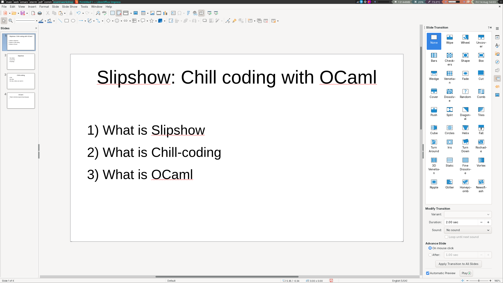

---
dimension:16:9
toplevel-attributes: slip focus="~duration:0 libreoffice"
---

{#libreoffice gui="~x:857 ~y:205 ~scale:0.289285"}

{unfocus}

1. Make a screenshot of a bad google slides presentation (remove slipshow ui in the meantime)

# Slipshow's experience report

## Chill-coding vs vibe-coding

## Slipshow's presentation

### Two parts: An engine

- A presentation engine

  - Canvas browsing with zoom
  - Action scheduler
  - Drawing
  - Drawing editor
  - Speaker notes

### Two parts: A compiler

- A compiler from an extension of markdown
- With static analysis and diagnostics
- And a preview server
- Which means a previewer

### Two parts: Editor support

## From Javascript to OCaml

## Javascript

Show original code:

- The whole code
- Focus on:
  - 

## OCaml

Error-oriented programming
- Adding a new message

It originated

## A celebration of the OCaml ecosystem

