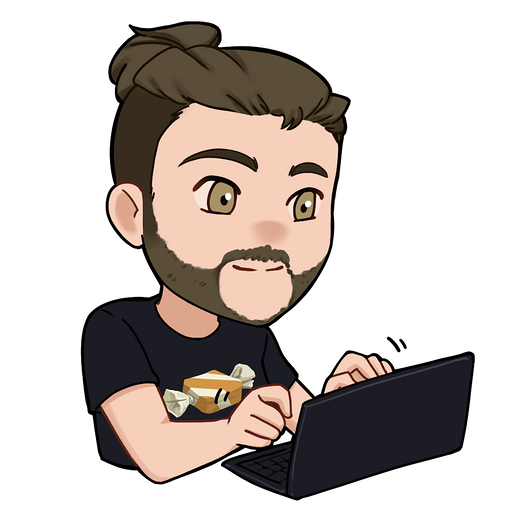
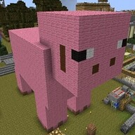
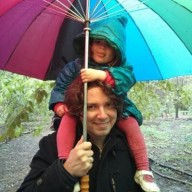
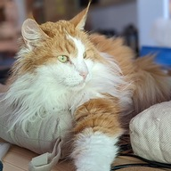
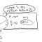
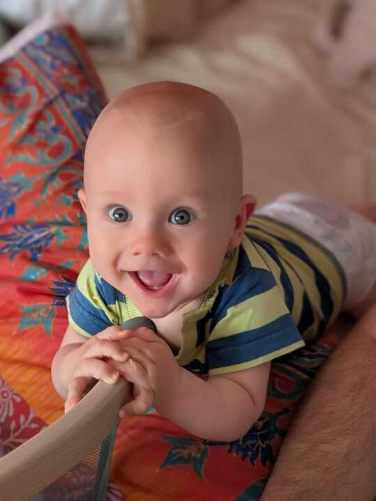
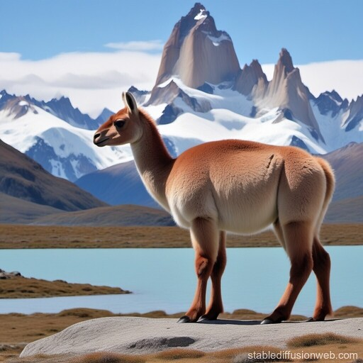
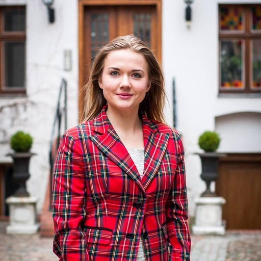
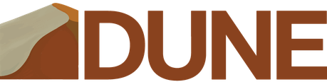
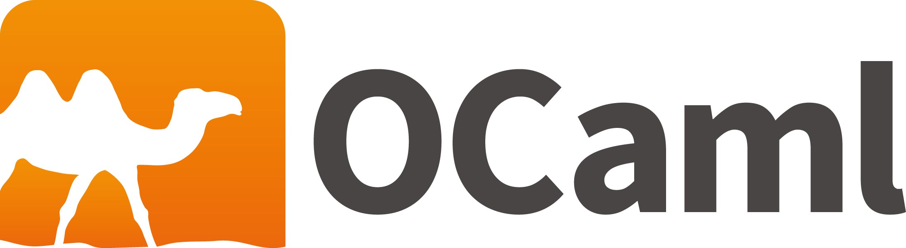

# The world after Odoc 3

{pause}

<style>
#box1 {
  position: absolute;
  width: 420px;
  height: 450px;
  top: 210px;
}
#box2 {
  position: absolute;
  width: 950px;
  height: 450px;
  top: 210px;
  left:387px;
}
code {
  background: lightgrey;
  padding-top: 3px;
  padding-left: 3px;
}
pre {
  background: lightgrey;
}
.two_elems > * {
  width: 50%
}
.three_elems > * {
  width: 33%
}
.four_elems > * {
  width: 25%
}
.notification {
  font-size: 1.1em;
  line-height: 43px;
  position: fixed;
  top: 10px;
  border: 2px solid black;
  right:-1480px;
  width: 1440px;
  background: bisque;
  padding: 10px;
  padding-top: 10px;
  border-radius: 10px;
  transition: all 0.75s 3s;
}
.notification.active {
  right:20px;
}
.notification.active.dismissed {
display: none;
}
.notification img {
  float:left;
  height:100px;
  margin-right: 10px;
}
.youneedto {
  color: blue;
  font-size: 0.8em
}
</style>

{.notification slipshow-ui #riku}
>  Hello Paul-Elliot ! I'm sorry to interrupt your talk but you should create proposals in order to do community work. **Could you create a proposal for your talk?**


{.notification slipshow-ui #leandro}
 Hello Paul-Elliot! Sorry to interrupt your talk, but could you add metrics to measure the impact of your presentation? I'm available to help!

{.notification slipshow-ui #jules}
 Yo ! Ça te tente un coffee-chat ?

{.notification slipshow-ui #jon}
 Hi Paul-Elliot! That reminds me: could you review my [+19242]{style="color:green"},[-454]{style="color:red"} lines WIP commit?

{.notification slipshow-ui #jon2}
 Hi Paul-Elliot! That reminds me: could you review my [+1965456242]{style="color:green"},[-4]{style="color:red"} lines PR from yesterday?

{.notification slipshow-ui #lyrm}
>  Hello Paul-Elliot ! Would you mind speaking about Argos too? It is part of your "world after odoc 3"!

{.notification slipshow-ui #abdulaziz}
>  Hey, since you are giving this talk at Tarides, maybe you could use this opportunity to promote Outreachy? It was such a great internship!

{.notification slipshow-ui #sabine}
>  Hello Paul-Elliot! I'm sorry, I think speaking about Argos or outreachy will disturb the talk about odoc. Could you focus on odoc?

{.notification slipshow-ui #agenda}
>  Event reminder: Sabine's birthday (today)

{.notification slipshow-ui #cake}
>  Happy birthday Sabine!

{.notification slipshow-ui #nathalie}
>  Salut Chéri ! <br> On se voit ce soir ? 💘❤️‍🔥

{.notification slipshow-ui #ganesh}
>  Hello Paul-Elliot! Now that your presentation is finished, could you fill your 68765 missing weeklies?

{.notification slipshow-ui #sonja}
>  Look how cute he is! {style="float:none; height:600px; vertical-align:top;"}

{.notification slipshow-ui #xvw}
>  Hello! You said your presentation was going to be 15 min. Hurry up for the other speakers! Your presentation is completely absurd! (`ocaml-eglot` is great!)

{.notification slipshow-ui #arthur}
>  J'ai rien compris ! 🤣

{.notification slipshow-ui #cuit}
>  Bravo! But what about category theory?

{.notification slipshow-ui #antonin1}
>  Ouh yeah! 👏👏👏👏👏👏👏👏👏👏👏👏👏👏👏👏

{.notification slipshow-ui #antonin2}
>  I have a question! Do you like my new handle, "hexadecimo"?


{.notification slipshow-ui #isabella}
>  Pretty cool! But I have found a typo.


{.block}
In March 2025, the face of the world changed: `odoc.3.0.0` was released.

- Added hierarchy to documentation,   [$\leftarrow$ you need to **specify your hierarchy**]{.unrevealed .youneedto style="margin-left: 220px"}

- Added medias (images, audios, ...) and assets, [$\leftarrow$ you need to **specify your media files**]{.unrevealed .youneedto style="margin-left: 60px"}

- Added cross-package links [$\leftarrow$ you need to **specify your dependencies**]{.unrevealed .youneedto style="margin-left: 327px"}

- Added source rendering [$\leftarrow$ you need to **update the build system**]{.unrevealed .youneedto style="margin-left: 365px"}

{pause exec-at-unpause=reveal-tooling}


{#reveal-tooling}
```slip-script
document.querySelectorAll(".youneedto").forEach((e)=> slip.setClass(e, "unrevealed", false));
```

**Actually not available: Locked behind tooling**

- `dune build @doc` did not enable the new features,

- `ocaml.org` did not enable the new features. {pause}

{.block}
The face of the world changed, but **not much has changed** for the average ocamleer.

{style="text-align: center; font-size: 2em" #wtd}
So, what to do?

{style="display: flex" .two_elems #container pause up=wtd exec-at-unpause=activate-lyrm}
>
> <!-- > {#activate_riku} -->
> <!-- > ```slip-script -->
> <!-- > slip.setClass(document.querySelector("#riku"), "active", true) -->
> <!-- > ``` -->
> <!-- > -->
> <!-- > {exec-at-unpause} -->
> <!-- > ```slip-script -->
> <!-- > slip.setClass(document.querySelector("#riku"), "dismissed", true) -->
> <!-- > ``` -->
>
> {style="display: none"}
> > {#activate-lyrm}
> >  ```slip-script
> >  slip.setClass(document.querySelector("#lyrm"), "active", true)
> >  ```
> >
> >  {exec-at-unpause}
> >  ```slip-script
> >  slip.setClass(document.querySelector("#lyrm"), "dismissed", true)
> > argos = document.querySelector("#argos")
> > container = document.querySelector("#container")
> >
> > slip.setStyle(argos, "width", "33%")
> > slip.setClass(container, "two_elems", false)
> > slip.setClass(container, "three_elems", true)
> > slip.setClass(document.querySelector("#abdulaziz"), "active", true)
> > ```
> >
> >  {exec-at-unpause}
> >  ```slip-script
> >  slip.setClass(document.querySelector("#abdulaziz"), "dismissed", true)
> > argos = document.querySelector("#argos")
> > outreachy = document.querySelector("#outreachy")
> > container = document.querySelector("#container")
> >
> > slip.setStyle(argos, "width", "25%")
> > slip.setStyle(outreachy, "width", "25%")
> > slip.setClass(container, "three_elems", false)
> > slip.setClass(container, "four_elems", true)
> > slip.setClass(document.querySelector("#sabine"), "active", true)
> > slip.setClass(document.querySelector("#agenda"), "active", true)
> > slip.setClass(document.querySelector("#cake"), "active", true)
> > ```
> >
> >  {exec-at-unpause}
> >  ```slip-script
> > slip.setClass(document.querySelector("#sabine"), "dismissed", true)
> > slip.setClass(document.querySelector("#agenda"), "dismissed", true)
> > slip.setClass(document.querySelector("#cake"), "dismissed", true)
> > argos = document.querySelector("#argos")
> > outreachy = document.querySelector("#outreachy")
> > container = document.querySelector("#container")
> >
> > slip.setStyle(argos, "width", "0%")
> > slip.setStyle(outreachy, "width", "0%")
> > slip.setClass(container, "two_elems", true)
> > slip.setClass(container, "four_elems", false)
> > ```
> >
>
>
> {#activate-jules}
> ```slip-script
> slip.setClass(document.querySelector("#jules"), "active", true)
> ```
>
> {#activate-sonja}
> ```slip-script
> slip.setClass(document.querySelector("#sonja"), "active", true)
> ```
>
> {#activate-xvw}
> ```slip-script
> slip.setClass(document.querySelector("#xvw"), "active", true)
> ```
>
>
>
>
>
>
> {slip}
> > # {height=100px style="padding-right: 8px;vertical-align: -5px;"} and [odoc 3]{style="font-size:2em"}
> >
> > {#specify}
> > ## 1. Specify
> >
> > ### Offer new stanza options for referencing other packages
> >
> > {.unrevealed reveal-at-unpause exec-at-unpause=activate_leandro}
> > > ```
> > > (package
> > >   (depends ...)
> > >   (documentation
> > >     (depends ...))
> > > ```
> > >
> > {#offer-new-stanza}
> > ### Offer new stanza options for assets and hierarchical documentation
> >
> > {#activate_leandro}
> > ```slip-script
> > slip.setClass(document.querySelector("#leandro"), "active", true)
> > ```
> >
> > {exec-at-unpause}
> > ```slip-script
> > slip.setClass(document.querySelector("#leandro"), "dismissed", true)
> > ```
> >
> > {.unrevealed reveal-at-unpause up=specify}
> > > {#afterdune}
> > > > 
> > > > ```txt
> > > > (documentation
> > > >   (files <files and hierarchy target>))
> > > >            ; the stanza above includes assets / hierarchy
> > > > ```
> > > {.unrevealed reveal-at-unpause up=afterdune #examples-dune pause_root}
> > > > #### Examples
> > > > ```
> > > > (documentation
> > > >  (files
> > > >   (glob_files *.mld)         ; Include mld files
> > > >   (glob_files *.png)))       ; and png images
> > > > ```
> > > > 
> > > > ```
> > > > (documentation
> > > >  (files
> > > >   (dune-project.mld as reference/dune-project.mld)))
> > > > ```
> > > > {pause down=lastduneex}
> > > > ```
> > > > (documentation
> > > >  (files
> > > >   (glob_files_rec            ; Include `doc/`, keep hierarchical
> > > >    (doc/* with_prefix .))))  ; structure for documentation
> > > > ```
> > > >
> > > > { #lastduneex}
> > > > ```
> > > > doc/index.mld            ->  <pkg doc root>/index.html
> > > > doc/tuto/index.mld       ->  <pkg doc root>/tuto/index.html
> > > > doc/tuto/tutorial1.mld   ->  <pkg doc root>/tuto/tutorial1.html
> > > > ```
> >
> > {pause_root}
> > > ## 2. Respect the specification
> > >
> > > {pause up=lastduneex}
> > > There are two kind of "drivers" for `odoc`:
> > >
> > > {.block}
> > > - `dune`, `bazel`, `ninja`.
> > >   - They build doc for a local project.
> > >
> > >   - They rely on a their internal project knowledge.
> > >
> > > {.block #opamconv}
> > > - `odig`, `odoc_driver`, `voodoo`.
> > >   - They build doc for `opam`-installed packages.
> > >
> > >   - They rely on a convention on installed files: eg pages are installed on `<switch root>/doc/<pkg name>/odoc-pages/`.
> > >
> > > {pause #installfiles up=opamconv exec-at-unpause=activate-sonja}
> > > ### Install files for odig/ocaml.org's driver
> > >
> > > {exec-at-unpause}
> > > ```slip-script
> > > slip.setClass(document.querySelector("#sonja"), "dismissed", true)
> > > ```
> > >
> > > Dune needs to respect the install convention given the user specification.
> > >
> > > {pause}
> > > ```txt
> > > (documentation (files ...))
> > >     ->  <switch>/doc/<pkg>/odoc-pages/index.mld
> > >     ->  <switch>/doc/<pkg>/odoc-pages/logo.png
> > >     ->  <switch>/doc/<pkg>/odoc-pages/reference/dune-project.mld
> > >
> > > (package (documentation (depends ...)))
> > >     ->  <switch>/doc/<pkg>/odoc-config.sexp
> > > ```
> > > This enables the new features for `odoc_driver`.
> > >
> > > {pause up=installfiles exec-at-unpause=activate_jon}
> > > ### Rewrite the "dune rules" to build documentation with the new CLI
> > >
> > > ```bash
> > > $ odoc compile --parent-id <pkgname>/tuto/ tutorial1.mld
> > > ```
> > >
> > > > That looked a bit complicated [$\rightarrow$]{style="padding-left:15px;padding-right:15px;"}
> > > > **Jon will take care of it.**
> > >
> > > {#activate_jon}
> > > ```slip-script
> > > slip.setClass(document.querySelector("#jon"), "active", true)
> > > ```
> > >
> > > {exec-at-unpause}
> > > ```slip-script
> > > slip.setClass(document.querySelector("#jon"), "dismissed", true)
> > > ```
> > >
>
> {step style="display: none"}
>
> {slip}
> > # {height=130px style="padding-right: 8px;vertical-align: -20px;"}.org and [odoc 3]{style="font-size:2em"}
> >
> > {width="100%" style="margin-bottom: -100px"}
> > 
> > - Write a new CI that uses `odoc_driver` to build the documentation
> >
> > {.unrevealed #jontookcare .block}
> > > That looked a bit complicated [$\rightarrow$]{style="padding-left:15px;padding-right:15px;"}
> > > **Jon took care of it.**
> >
> > - Use the output of the new CI in ocaml.org to get documentation
> >
> > {.unrevealed #handlingredir .block}
> > > - Handling redirection,
> > > - New CSS,
> > > - Replace Ocaml.org's sidebar and breadcrumbs,
> > > -  ...
> > >
> > > Converting to HTML is not as easy as it seems!
> >
> >
> > {#box1}
> > >
> >
> > {#box2}
> > >
> >
> > {step focus-at-unpause=box1 exec-at-unpause=activate-jules}
> >
> > {exec-at-unpause}
> > ```slip-script
> > slip.setClass(document.querySelector("#jules"), "dismissed", true)
> > slip.setClass(document.querySelector("#nathalie"), "active", true)
> > ```
> >
> > {exec-at-unpause}
> > ```slip-script
> > slip.setClass(document.querySelector("#nathalie"), "dismissed", true)
> > ```
> >
> > {step unfocus-at-unpause}
> >
> > {step reveal-at-unpause=jontookcare exec-at-unpause=activate-jon2}
> >
> > {#activate-jon2}
> > ```slip-script
> > slip.setClass(document.querySelector("#jon2"), "active", true)
> > ```
> >
> > {exec-at-unpause}
> > ```slip-script
> > slip.setClass(document.querySelector("#jon2"), "dismissed", true)
> > ```
> >
> > {step focus-at-unpause=box2 exec-at-unpause=activate-xvw}
> >
> > {exec-at-unpause}
> > ```slip-script
> > slip.setClass(document.querySelector("#xvw"), "dismissed", true)
> > ```
> >
> >
> >
> > {step unfocus-at-unpause}
> >
> > {step reveal-at-unpause=handlingredir down-at-unpause=handlingredir}
> >
>
> {slip no-enter #argos style="width:0%"}
> > # [Argos]{style="font-size: 2em"}
> >
> > - A tool to catch bitcoin's bad guys
> >
> > - Better than the concurrents!
> >
> >
>
> {slip no-enter #outreachy style="width:0%"}
> > # [Outreachy mentoring]{style="font-size: 2em"}
> >
> > - Super nice experience
> >
> > - Sometimes very strong candidates
> >
> > - What you do is helpful
>

{step}

{#duneprs pause exec-at-unpause=activate-ganesh}
> [ocaml/dune#11800](https://github.com/ocaml/dune/pull/11800) and [ocaml/dune#11716](https://github.com/ocaml/dune/pull/11716)

{#ocamlprs}
> [ocaml/ocaml.org#3124](https://github.com/ocaml/ocaml.org/pull/3124)

{#ty}
> # Thank you for your attention

> {#activate-ganesh}
> ```slip-script
> slip.setClass(document.querySelector("#ganesh"), "active", true);
> slip.setClass(document.querySelector("#cuit"), "active", true);
> slip.setClass(document.querySelector("#arthur"), "active", true);
> slip.setClass(document.querySelector("#antonin1"), "active", true);
> slip.setClass(document.querySelector("#antonin2"), "active", true);
> slip.setClass(document.querySelector("#isabella"), "active", true);
> ```
<!-- > -->
<!-- > {exec-at-unpause} -->
<!-- > ```slip-script -->
<!-- > slip.setClass(document.querySelector("#ganesh"), "dismissed", true) -->
<!-- > ``` -->
>

<style>
#cuit {
  top: 200px;
  transition-delay: 4.5s;
}
#agenda {
  top: 200px;
  transition-delay: 6s;
}
#antonin1 {
  top: 371px;
  transition-delay: 5s;
}
#cake {
  top: 371px;
  transition-delay: 6.5s;
}
#arthur {
  top: 544px;
  transition-delay: 5.3s;
}
#antonin2 {
  top: 717px;
  transition-delay: 6.7s;
}
#isabella {
  top: 890px;
  transition-delay: 7s;
}
#duneprs {
    position: absolute;
    top: 1326px;
    padding: 30px;
    width: 400px;
    background: yellow;
    left: 181px;
}
#ocamlprs {
    position: absolute;
    top: 1326px;
    padding: 30px;
    width: 400px;
    background: yellow;
    left: 781px;
}
#ty {
    position: absolute;
    top: 1726px;
    padding: 30px;
    width: 900px;
    background: yellow;
    left: 281px;
}
</style>
